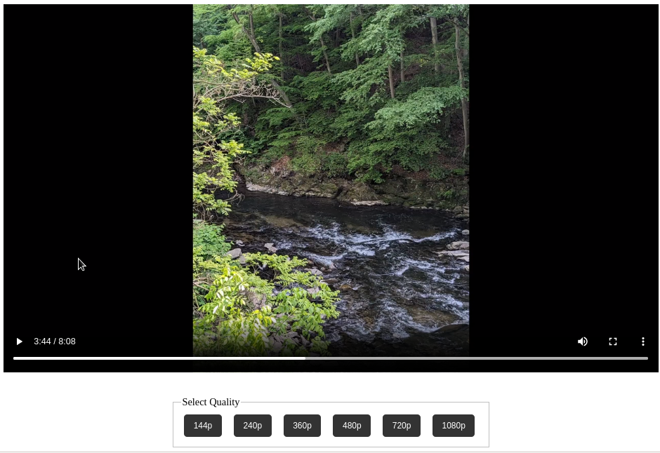

This repo contains scripts to quickly encode video and prepare HTML snippets for self-hosting videos on a blog. By using the `encoder.py` script, based on an input video you can produce a set of encoded video files playable by the great majority of current browsers at multiple resolutions (1080p, 720p, 480p, 360p, 240p, 144p). `template.html` contains a video player widget which can be used on a blog or similar. 

This only requires a HTTPS server which stores the files, it does not use a video hosting platform. This code is useful for self-hosting video files if you do not want to use a service like Youtube/Vimeo/Odyssey/etc to host a collection of long form video content for your blog or personal website, but you find full-featured self-hosted video platforms like Peertube/LBRY/MediaCMS/etc too bulky and heavy weight for your needs. 

# encoder.py 

The command line usage of this script is as follows `python3 script.py <input_file>`

The script will also prompt for the URL (without https) where the videos will be hosted. This should be a domain name + a path (if needed) ie. `videofiles.example.com/VideoFilePath`. Once the encoding is complete, use your prefered method to upload the encoded files to the HTTPS server in the correct path. 

FFmpeg needs to be installed, but any any corresponding python library. Otherwise, this script's only dependencies are in the Python standard library. 

This python script writes the following to the current working directory: A set of encoded video files corresponding to the following resolutions 2160p, 1080p, 720p, 480p, 360p, 240p, 144p

The output video files are in MP4 with H.264 and AAC.

A mobile browser is any browser for which `navigator.userAgent` in Javascript contains any of the following strings `iPhone`, `iPad`, `iPod`, `Android`. 

The name of JS functions, and HTML IDs is randomized in order to make it possible for multiple copies of the code to exist on the same web page (ie. for something like a blog homepage).

The bit rates of the encoded video files are as follows

|       | Video   | Audio   |
|-------|---------|---------|
| 144p  | 200kbps | 32kbps  |
| 240p  | 400kbps | 64kbps  |
| 360p  | 1mbps   | 128kbps |
| 480p  | 4mbps   | 360kbps |
| 720p  | 7.5mbps | 360kbps |
| 1080p | 12mbps  | 360kbps |
| 2160p | 68mbps  | 360kbps |

# videotemplate.html

The `videotemplate.html` file contains a template (HTML/Javascript/CSS) for a video player widget. The completed HTML code can then be added to another website, or the HTML editor of a blogging engine. 

The JavaScript in the widget generates the options for video resoloution plaback based on the value in the `
` on line 61

`
`

`data-base-url="https://files.theopjones.blog/PhotoWalkMar242023/PhotoWalkMay25` is the URL of the video files minus the file extension and the resolution appended to the name of the files that `encoder.py` generates. Ie. If your input file's name to `encoder.py` was `videofile.mp4` and the path to the folder on your server where the videos are hosted is `https://example.com/myfolder` the `data-base-url` should be `https://example.com/myfolder/videofile`. `data-poster` should be the URL of the image used as a preview image/thumbnail of the video.

This template uses the HTML5 video attribute to play a video. Controls are enabled. The code supports the option for multiple resolutions, and allows switching between the resolutions. 

The `<video>` object will autoscale based on the size of the container that it is in, but this will not cause the resolution of the video to change without user intervention. 

A screenshot of this widget is as follows. 

# Video Player with Resolution Control

This project is a custom HTML5 video player with resolution control. It uses a mix of HTML, CSS, and JavaScript to implement a video player interface that allows users to switch between different video resolutions. 

## Overview

### HTML

Each video is contained within a `
` element with the class `videoContainer`. This div contains:

- A `<video>` element with the class `myVideo`. This is the actual video player.
- A `<source>` element with the class `myVideoSource` which is the child of the video element. This is used to provide the video file to the video player.
- A `
` element with the class `playButton`. This is a custom play button that overlays the video player.
- A `
` element with the class `videoButtons`. This is a container for the resolution buttons that will be created by the JavaScript code.

### CSS

The CSS is used to style the video player, the play button, and the resolution buttons. The play button is positioned absolutely in the center of the video player except for a padding that makes it appear more centered to the eye given the shape of the play emoji, and the video player takes up 100% of the width of its container.

### JavaScript

The JavaScript code primarily interacts with the elements within each `.videoContainer`. The code is designed to work with multiple video containers on the same page.

Here's a high-level overview of what the JavaScript does:

1. For each `.videoContainer`, it generates a random string to use as unique ID suffixes for the `myVideo`, `myVideoSource`, and `playButton` elements.
2. It gets the `data-base-url` and `data-poster` attributes from the `.videoContainer` to use as the base URL for the video files and the URL for the video's poster image.
3. The `playButton`'s `onclick` event is set to play the video at 720p quality when the button is clicked.
4. A list of resolution options is iterated over. For each resolution, a button is created and appended to the `videoButtons` div. When clicked, each button changes the video's resolution.
5. Functions `playVideo` and `changeQuality` are used to play the video and change its quality respectively. They do this by setting the `src` attribute of the `myVideoSource` element and calling the `load` and `play` methods on the `myVideo` element. Additionally, they hide the `playButton` and make the native video controls visible when the video is playing.

When a resolution button is clicked, or when the custom play button is clicked, the video changes to the selected resolution and begins to play. The native video controls become visible, and the custom play button is hidden.

This script dynamically adds the required functionality and event handlers to each video container on the page, making it versatile and reusable for multiple videos.

